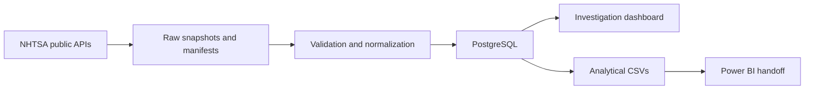

# Auto Quality Lab

A public-data workbench for reviewing automotive complaint reporting patterns. The intended user is a quality analyst deciding which model-year/component groups need manual investigation. This is an independent portfolio project, not an automaker's internal system.

## What this project demonstrates

- Python ingestion with source-count checks, retries, and hashed source provenance.
- PostgreSQL tables and bridge relationships that preserve distinct complaint counts.
- Transactional refreshes with repeat-load, source-removal, and rollback tests.
- A local investigation dashboard with receipt-time filtering, component screening, and narrative evidence.
- Analytical CSVs and documented Power BI measures for a future Windows deliverable.

Current status: working starter environment with reporting-date and model-label audits. Monitoring rules are heuristics awaiting evaluation. Separately named variants are excluded; see docs/coverage-audit.md. A native Power BI report and final analytical case studies are not yet complete.



## Clone and install

Clone this repository and enter its folder. With Python 3.12+ available:

```sh
python3 -m venv .venv
.venv/bin/python -m pip install -r requirements.txt
.venv/bin/python -m pip install -e .
```

The native database launcher below targets the existing Homebrew PostgreSQL installation on macOS. For another machine, point `AUTO_QUALITY_PG_BIN` to compatible PostgreSQL binaries or set `DATABASE_URL` to your own PostgreSQL database. The schema is initialized automatically by the pipeline. No downloaded owner records are shipped with the repository.

The committed `requirements.lock.txt` records the original macOS environment. Use `requirements.txt` when resolving dependencies on Linux or Windows; the lock contains platform-specific macOS packages.

## Environment

- Python 3.12 in `.venv`, isolated from system Python.
- PostgreSQL 18, project-owned cluster in `.runtime/postgres`, listening only on `127.0.0.1:55432`.
- Streamlit and Plotly dashboard at `http://127.0.0.1:8501`.
- NHTSA complaints and recall APIs; raw response archives and hashed manifests.
- SQL views, analytical CSV exports, source reconciliation, pytest, and a starter notebook.

The initial cohort includes Civic, Accord, Corolla, Camry, Mazda3, and Golf, model years 2018–2022. This is a starting scope, not complete coverage of each model's trims or alternative powertrains. Update `config/cohort.json` to change scope.

## Start the existing environment

From this folder:

```sh
sh scripts/start-db.sh
sh scripts/dashboard.sh
```

Or double-click `Launch Auto Quality Lab.command` in Finder. The launcher opens a terminal, starts the database, and runs the dashboard. Open the local URL in your browser. Close the dashboard terminal or press Control-C to stop it. PostgreSQL stays running until explicitly stopped:

```sh
sh scripts/stop-db.sh
```

Local database authentication trusts local connections. This is a development cluster, not a production configuration. Raw data, database files, environment settings, and generated exports are ignored by Git. Do not publish the runtime or raw directories.

## Refresh and verify

```sh
.venv/bin/python -m auto_quality.pipeline
.venv/bin/python scripts/validate.py
.venv/bin/python scripts/profile_dates.py --as-of 2026-09-30
.venv/bin/python scripts/audit_coverage.py
.venv/bin/python scripts/evaluate_screening.py
.venv/bin/python scripts/prepare_review.py
.venv/bin/python scripts/export.py
.venv/bin/python -m pytest
```

The GitHub workflow runs unit tests and integration tests with a disposable PostgreSQL service. Integration tests operate in temporary test schemas and require no NHTSA downloads. To run them locally, set `AUTO_QUALITY_INTEGRATION=1` when invoking pytest with the project database running.

Refresh makes two source requests per configured model-year, with two concurrent requests and retries for transient failures. All downloads must succeed before the database changes. Database updates happen in one transaction. Source removals from refreshed model-year mappings are reflected. Source records with no remaining mappings are removed from analytical tables; raw snapshots remain preserved.

Some NHTSA zero-result recall queries return HTTP 400 with an explicit successful empty payload. That exact case is accepted and its HTTP status is preserved in the manifest. Other HTTP errors stop the load.

To reproduce a downloaded snapshot without network access:

```sh
.venv/bin/python -m auto_quality.pipeline --offline-manifest data/processed/latest_manifest.json
```

This verifies the raw file hashes before loading. The manifest contains request URLs, retrieval timestamps, counts, and file hashes. `scripts/validate.py` reconciles distinct source complaint/campaign identifiers against each loaded model-year mapping.

## Rebuild Python dependencies

Use a Python 3.12+ interpreter to create `.venv`, then:

```sh
.venv/bin/python -m pip install -r requirements.lock.txt
.venv/bin/python -m pip install -e .
```

The local database scripts use the existing Homebrew PostgreSQL 18 installation. Set `AUTO_QUALITY_PG_BIN` to another compatible PostgreSQL binary directory if needed. Python access uses `DATABASE_URL` from `.env`, or defaults to `postgresql://127.0.0.1:55432/auto_quality`.

## Work in an editor

Select `.venv/bin/python` as the Python interpreter and notebook kernel. Open `notebooks/01_source_profile.ipynb` to inspect source coverage and component counts. Database queries are in `sql/`; application code is in `src/auto_quality/`.

## Interpretation

Counts are reports received, not verified failures or rates. The screening rule compares adjacent 90/180/365-day windows and requires at least the selected minimum recent reports, five additional reports, and twice the baseline (or a zero baseline). Thresholds are configurable heuristics. They have not yet been validated as an effective alerting policy.

The receipt cutoff defaults to the last completed calendar month. Historical views use today's revised records and are not exact point-in-time data. Recall associations are model/year context, not confirmed links to complaint defects or individual VINs. Missing severity values remain unknown.

Read `docs/project-plan.md`, `docs/data-dictionary.md`, and `docs/power-bi.md` before extending the analysis.
